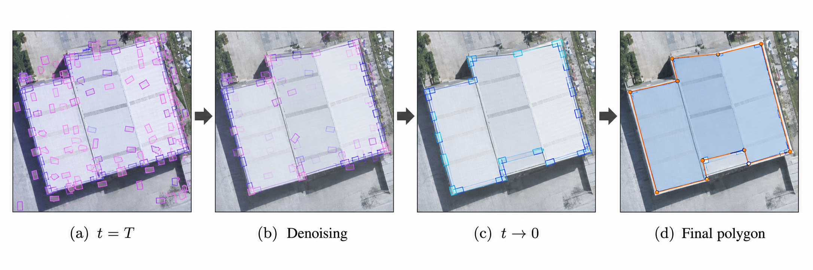
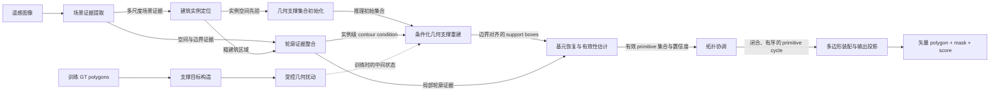

# P2PFormerV3 Macro Design

> 状态：Macro Design v0.2（已批准，2026-08-02）
> 设计阶段：宏观架构已冻结；已进入 [Micro Design](P2PFormerV3_Micro_Design.md)
> 核心假设：本文中的“几何分割框”指面向单个建筑轮廓基元的 **geometric support box（几何支撑框）**，而不是最终建筑实例检测框。

## 0. 结论先行

P2PFormerV3 不应被定义成“把 P2PFormerV2 的 decoder 换成扩散模型”，也不应只把 FCOS 换成 DiffusionDet。更有代际逻辑、也更容易形成独立贡献的定义是：

> **在 P2PFormerV2 已建立的 contour-aware 条件特征上，通过条件集合扩散生成并修正一组贴合建筑边界的 primitive-level geometric support boxes，再恢复有效几何基元、显式协调闭合拓扑，最终输出规则矢量多边形。**

这条路线把三代工作的核心问题清楚地区分开：

| 版本 | 核心问题 | 已完成的能力 |
|---|---|---|
| P2PFormer | “预测什么、如何组装” | 将轮廓拆成角点/线等局部 primitive，预测存在性与顺序并组装 polygon |
| P2PFormerV2 | “从哪里读取有效边界证据” | 用稀疏—稠密轮廓特征增强与融合，降低无效采样造成的漏检/误检 |
| **P2PFormerV3（建议）** | “如何生成不确定、可修正的几何支撑集合，并保证整体结构有效” | 条件扩散生成 primitive 支撑框；对 proposal 扰动、弱边界和多解更稳健；几何与拓扑协同验收 |

这里的 support box 是“一个局部边界 primitive 应当从哪里获得几何证据”的空间脚手架，不是最终 polygon，也不应成为唯一取特征的窗口。最终坐标仍由轮廓证据与几何支撑共同恢复，闭合性、邻接关系和非自交性由独立的拓扑阶段负责。

---

## 1. 任务需求与成功标准

### 1.1 场景、输入与输出

- 场景：高分辨率遥感影像中的规则建筑实例轮廓提取，兼顾密集建筑、大尺度建筑、弱边界、遮挡及复杂凹轮廓。
- 输入：RGB 影像 `I ∈ R^{B×3×H×W}`。
- 训练标注：建筑实例 box、polygon/mask；由 polygon 确定性构造 primitive 与其局部 support target。
- 输出：每个建筑实例的可变长有序顶点集合 `P_i ∈ R^{K_i×2}`、实例置信度及可选栅格 mask。
- 保持 P2PFormer 的核心资产：显式矢量轮廓、primitive 表示和直接 polygon 输出。

### 1.2 建议的验收指标

最终门槛应由统一复现实验确定，至少覆盖：

1. **实例质量**：COCO mask AP、AP50、AP75。
2. **边界质量**：Boundary IoU、PoLiS/Chamfer 类轮廓距离、corner/edge precision-recall。
3. **结构合法性**：自交率、重复 primitive 率、退化 polygon 率、漏点率、闭合失败率。
4. **鲁棒性**：检测框中心/尺度/长宽比扰动，primitive proposal 随机丢失，遮挡与弱边界子集。
5. **效率**：端到端 latency/FPS、不同重建步数下的质量—速度 Pareto，以及峰值显存。

### 1.3 扩散成立的必要条件

扩散不是预设正确答案。V3 必须证明：

- 多步条件重建在困难子集或 proposal 扰动下显著优于同条件、同容量的一步确定性回归器；
- 增益来自“生成/纠错不确定几何集合”，而不只是更深、重复调用的 decoder；
- 少步推理可以形成可接受的质量—速度 Pareto；
- 若一步模型已达到相同精度和鲁棒性，则应放弃扩散叙事，保留更简单的迭代几何 refiner。

---

## 2. P2PFormer 回顾：已经解决了什么

### 2.1 可核数据流

P2PFormer 实际是一个 detection-first 轮廓系统：

```text
RGB image
→ backbone + multi-scale neck
├─ FCOS → building boxes
└─ high-resolution feature + per-building box
   → fixed-size instance feature
   → 30 primitive queries
   → primitive geometry + foreground score + 36-bin order
   → threshold + order sorting
   → vector polygon → raster mask
```

代码证据如下：

- 训练时 contour head 使用 GT boxes，而推理时使用 detector boxes，见 [`p2pformer.py`](../p2pformer/models/p2pformer.py#L48-L94) 与 [`p2pformer.py`](../p2pformer/models/p2pformer.py#L121-L152)。
- 默认每个实例使用 `30` 个 primitive queries、`36` 个顺序类别和三层解码，见 [WHU-Mix 配置](../p2pformer/configs/configs/p2pformer_corner_r50_whu-mix.py#L77-L150)。
- 每个角点被表示为 `[previous, current, next]` 三点局部 primitive；训练使用 Hungarian assignment，见 [`custom_pipelines.py`](../p2pformer/dataset/pipelines/custom_pipelines.py#L87-L107) 与 [`line_assigner.py`](../p2pformer/models/line_assigner.py#L13-L66)。
- 推理以 `0.8` 阈值独立筛选 primitive，按各自的 order argmax 排序，只取三点 primitive 的中心点作为 polygon 顶点，见 [`CornerPolygon`](../p2pformer/models/p2pformer.py#L261-L287)。
- 官方论文将核心概括为 detector、primitive segmenter 与 order decoder；详见 [P2PFormer](https://arxiv.org/abs/2406.02930)。

### 2.2 P2PFormer 的实质贡献

1. 将像素级 building mask 转换为紧凑、可编辑的显式 vector polygon。
2. 用局部三点 primitive 同时表达角点及相邻边方向。
3. 用固定槽集合 + Hungarian matching 处理 query 排列不变性和可变有效顶点数。
4. 用实例检测完成建筑分离，再在实例区域内恢复精细轮廓。
5. 用顺序预测把无序 primitive 集合还原为近似环序。

仓库报告 WHU-Mix test1/test2 的 mask AP 为 `60.6/50.7`，本地 README 记录的复现结果为 `60.3/49.9`；见 [README](../README.md#L73-L78)。

### 2.3 尚未解决的结构性缺口

| 缺口 | 代码层事实 | 对 V3 的含义 |
|---|---|---|
| 训练—推理 proposal gap | 训练用 GT boxes，推理用 FCOS boxes；训练扰动主要是统一扩框 | 必须让生成器在训练时见到中心、尺度、比例、缺失与冗余等真实扰动 |
| 固定复杂度 | 每实例最多 30 个有效角点 | 生成表示必须显式处理 null/validity，并验证复杂轮廓上的容量边界 |
| 顺序不等于拓扑 | 30 个 query 独立做 36 类分类，排序后没有一一邻接、自交或闭合检查 | V3 不能只生成坐标；必须单列 topology reconciliation |
| 训练目标与最终 polygon 脱节 | 主要监督局部 primitive、存在性与独立顺序；没有完整 polygon 合法性目标 | 需要以最终轮廓质量和结构合法性作为验收目标 |
| 局部几何信息利用不足 | 回归 6D 三点 primitive，但最终只取中心 2D 坐标 | support box 应服务于完整局部几何恢复，而非成为新的冗余中间量 |
| 无效采样与大建筑问题 | 固定区域采样难覆盖真实边界 | 这正是 V2 已开始修复、V3 应继承的能力，而不是重新制造的问题 |

P2PFormer 论文也明确展示了 interior primitive、missing primitive 以及大建筑固定采样不足等失败情形。因此 V3 的突破点不应只是“更多 query”或“换一种 decoder”，而应同时处理几何 proposal 的分布、纠错和整体结构约束。

---

## 3. P2PFormerV2 回顾：代际增量与证据边界

### 3.1 可以确认的工作

P2PFormerV2 已发表于 IEEE TGRS 2025，正式条目为 [P2PFormerV2: Improving Primitive-Based Regular Building Contour Extraction Methods via Contour Feature Enhancement](https://doi.org/10.1109/TGRS.2025.3620903)。作者团队的[官方页面](https://gpcv.whu.edu.cn/)给出的核心动机是：V1 的均匀 RoI 采样包含大量轮廓外无效位置，容易导致 primitive 漏检和误检。

公开摘要与作者官方说明支持以下宏观结论：

1. V2 保留“检测框 → 实例轮廓特征 → primitive 与次序 → polygon”的基本范式。
2. 核心新增模块是 **Contour Feature Enhancer**。
3. 该增强器包含语义上的三个功能：
   - sparse feature extraction：提高有效轮廓采样位置的比例；
   - dense feature extraction：产生更丰富的轮廓证据，并引入辅助监督；
   - feature fusion：融合稀疏与稠密轮廓信息。
4. 论文摘要报告 WHU、CrowdAI、WHU-Mix 上的 AP 分别为 `74.7%`、`79.6%`、`64.2%`。不同资料的评测口径未完全展开，因此不能直接把 `64.2` 与 V1 README 的 test1/test2 数字相减。

### 3.2 不能越过的证据边界

截至 2026-08-02，当前仓库及已知官方 P2PFormer 仓库中仍未发现公开的 V2 分支、标签或实现；但用户现已提供[完整论文 PDF](../../.memory/artifacts/P2PFormerV2_Improving_Primitive-Based_Regular_Building_Contour_Extraction_Methods_via_Contour_Feature_Enhancement.pdf)，因而 Fig. 2–8、Eq. (1)–(7)、主要实现设置与消融表已经可以逐页审计。论文仍未闭合的复现细节包括：

- sparse offset 的坐标单位、stride、越界与 `grid_sample` 约定；
- dense attention 的 head/层数、crop 与 RoIAlign 的先后顺序；
- P2/P3/P4 的精确融合算子，以及 sparse/dense concat 后如何回到 256 通道；
- 二类 CE 与文中 sigmoid 描述的冲突、contour target 线宽和类别平衡；
- Feature Mask 的 threshold、硬/软形态学操作及其梯度路径；
- V2 参数量、FLOPs、硬件与推理速度。

因此，V3 Micro Design 可以按论文逆向一个 **V2-compatible contour conditioner**，但必须把上述接口补全明确标成“工程选择”，不能宣称为原作者未公开的实现事实。

### 3.3 从 V2 到 V3 的自然问题

V2 改善了边界证据，但没有从公开信息中显示它改变了以下生成机制：

- 轮廓仍从外部检测 proposal 开始；
- primitive 仍是一次性预测与筛选；
- 集合 cardinality、proposal 误差和多解不确定性没有被显式建模；
- 独立顺序预测仍不能自动保证一个合法闭合 cycle。

因此，V3 应把 V2 的 contour feature 当成**条件**，把创新集中在“几何支撑集合如何产生、如何纠错、如何与拓扑共同闭环”。

---

## 4. 为什么选择 primitive-level geometric support boxes

### 4.1 三条候选路线

| 路线 | 优点 | 根本问题 | 决策 |
|---|---|---|---|
| A. 扩散 scene-level building boxes | 可直接借鉴 diffusion detection，能改善实例 proposal | 主要解决检测，不直接解决轮廓 primitive；若每步只依赖 noisy RoI，还会重现 V2 的无效采样问题 | 作为对照或后续扩展，不做 V3 主贡献 |
| B. 直接扩散完整 polygon 顶点序列 | 输出路径最短，概念直观 | 可变长、起点/方向/循环等价与 `N!` 集合排列造成严重多解；拓扑错误被直接写入最终坐标 | 高风险研究支线，不做首个版本 |
| **C. 扩散 primitive-level support-box set** | 延续 P2PFormer primitive 表示；连续低维；可表达位置与局部尺度；容易做 validity 和 proposal 扰动 | box 不是最终轮廓，仍需 primitive recovery 与 topology reconciliation | **推荐主路线** |
| D. 一步确定性 support-box refiner | 快、训练简单 | 不能天然证明多模态生成和逐步纠错价值 | **必须保留为扩散必要性基线** |

### 4.2 与相关工作的边界

- [DDPM](https://arxiv.org/abs/2006.11239)提供连续高斯前向扰动与条件逆过程的基础。
- [DiffusionDet](https://openaccess.thecvf.com/content/ICCV2023/papers/Chen_DiffusionDet_Diffusion_Model_for_Object_Detection_ICCV_2023_paper.pdf)证明固定槽 box set 可以从噪声迭代恢复，但它生成的是物体检测框，不处理建筑轮廓 primitive 或闭合拓扑。
- [PolyDiffuse](https://proceedings.neurips.cc/paper_files/paper/2023/file/05f0e2fa003602db2d98ca72b79dec51-Paper-Conference.pdf)指出结构化几何集合存在排列等价和 proposal 分布错配，朴素高斯扩散会产生对应关系歧义；这要求 V3 在 clean target 上建立稳定 coupling/canonicalization，而不能每步任意换匹配。
- [DiffVector](https://doi.org/10.1109/TGRS.2025.3528474)已经把扩散用于建筑矢量化，因此 V3 **不能**宣称“首次用 diffusion 生成建筑 polygon”。可辩护的空白是：直接在稀疏 primitive support boxes 上做 proposal-resilient set generation，复用 V2 contour condition，并避免 dense node heatmap、NMS 再到 graph 的长误差链。
- [LDPoly](https://doi.org/10.1016/j.isprsjprs.2025.10.005)代表 raster latent/heatmap 后再 polygonize 的路线；V3 应保持显式稀疏几何，而不是回到依赖重后处理的密集栅格生成。

---

## 5. P2PFormerV3 Macro Architecture

### 5.0 理想化扩散效果示意



*概念示意（非实验结果）：(a) 从随机、错位、重复且可能越界的 primitive-level geometric support boxes 开始；(b) 在实例级 contour condition 引导下逐步抑制无效支撑并靠近真实边界；(c) 有效支撑框收敛到 corner/edge primitive；(d) 由恢复后的有效 primitive 形成单一、闭合且非自交的规则建筑 polygon。*

### 5.1 功能流程图



### 5.2 子模块、语义输入与输出

| # | 功能模块 | 语义输入 | 语义输出 | 设计职责 |
|---|---|---|---|---|
| 1 | 场景证据提取 | RGB image | 多尺度共享场景证据 `F` | 一次编码，供实例定位与轮廓条件共享；不随扩散步重复计算 |
| 2 | 建筑实例定位 | `F` | 粗实例区域集合 `R={r_i}` 与置信度 | 首版继承稳定的 V2/V1 定位能力，使研究变量集中在轮廓生成 |
| 3 | 轮廓证据整合 | `F, R` | 每实例 contour-aware condition `C_i` | 继承 V2 的稀疏—稠密—融合功能；条件证据独立于当前 noisy support boxes 存在 |
| 4 | 支撑目标/先验构造 | 训练：GT polygon；推理：实例空间先验与随机源 | 归一化几何支撑集合 `G_0` 或初始状态 `G_T` | 把每个局部 primitive 映射为可扰动的 support target；无效槽与几何连续量分开表达 |
| 5 | 条件化几何支撑重建 | `G_t, C_i, t` | 更干净的 support-set 状态或 clean-set 估计 | 在共享条件下逐步修正位置、覆盖范围与有效集合；保持 set-level 一致性 |
| 6 | 基元恢复与有效性估计 | clean support boxes、`C_i` | 几何 primitive、validity/type、质量分数 | support box 只是局部证据脚手架；此模块恢复精确角点/线段等最终几何量 |
| 7 | 拓扑协调 | primitive set、局部关系与质量 | 单一或少量候选的合法闭合 cycle | 处理重复、缺失、邻接冲突、方向、闭合与自交；替代“独立 36-bin 排序即拓扑”的假设 |
| 8 | 多边形装配与输出投影 | 有序 cycle、实例区域、图像元数据 | 可变长 polygon、mask、最终实例分数 | 映射到原图，生成矢量与标准评测输出，并用轮廓质量校准实例分数 |

### 5.3 宏观接口约束

以下是接口语义，不是最终 tensor/实现选择：

| 符号 | 语义 | 约束 |
|---|---|---|
| `F` | 全图多尺度特征 | 整张图只编码一次；扩散各步复用 |
| `R={r_i}` | 粗建筑实例区域 | 首版不与 primitive diffusion 同时重写，避免贡献纠缠 |
| `C_i` | 第 `i` 个实例的 contour-aware condition | 即使 `G_t` 在高噪声阶段偏离边界，仍能提供稳定全局/边界证据 |
| `G_t ∈ R^{M×d_g}` | 固定容量槽中的连续几何支撑状态 | 坐标在实例局部坐标系归一化；`M` 只决定训练容量，不等于最终顶点数 |
| `V_i` | support/primitive 的有效性与可选类型 | 属于离散语义，不应未经论证直接加入高斯连续噪声 |
| `U_i={u_j}` | 恢复后的可变长 primitive set | 一个 support 可以被判为空；最终 `K_i≤M` |
| `A_i` | primitive 邻接/循环结构 | 必须表达一个闭合 cycle，而非仅给每点独立序号 |
| `P_i ∈ R^{K_i×2}` | 最终有序 polygon | 需通过非退化、闭合、方向和自交合法性检查 |

### 5.4 必须保持的设计不变量

1. **support box 不是最终实例 box。** 它覆盖局部 corner/edge primitive 的证据范围。
2. **noisy box 不能成为唯一条件。** 高噪阶段若只从当前 box 做局部裁剪，极易采到背景并重现 V2 所修复的问题。
3. **连续几何与离散语义分治。** 高斯过程只用于经过规范化的连续几何；presence/type/topology 另行建模或在 clean-state 上判别。
4. **训练与推理同分布。** 训练必须包含中心、尺度、比例、冗余、缺失和 cardinality 扰动，不能只从完美 GT support 开始。
5. **集合对应关系稳定。** clean target 的 assignment/canonicalization 在时间步之间保持一致，避免 slot switching。
6. **几何与拓扑分别负责、联合验收。** box 提供局部支持，topology block 负责闭合结构，最终 polygon 指标负责端到端验收。
7. **首版控制变量。** 先保留 V2 的实例定位与 contour condition，再验证 support diffusion；不同时扩散 scene boxes 和 primitive boxes。

---

## 6. 扩散数学适配性审计

### 6.1 最小数学对象

令单个实例的 clean continuous support set 为 `G_0`，在固定容量槽中对有效几何进行归一化。标准前向过程可写为：

```math
q(G_t\mid G_0)=\mathcal{N}\left(\sqrt{\bar{\alpha}_t}G_0,\left(1-\bar{\alpha}_t\right)I\right),
```

等价采样为：

```math
G_t=\sqrt{\bar{\alpha}_t}G_0+\sqrt{1-\bar{\alpha}_t}\epsilon,
\qquad \epsilon\sim\mathcal{N}(0,I).
```

条件逆过程学习：

```math
p_\theta(G_{t-1}\mid G_t,C_i),
```

其中 `C_i` 是 V2 风格的实例级轮廓条件。预测 clean geometry、noise、velocity 或其他参数化属于 Micro Design 决策，本稿不提前锁定。

### 6.2 成立所需假设

- support geometry 能映射到连续、尺度稳定的局部坐标空间；尺寸、角度等周期/正值变量必须选择无奇点表示。
- 同一 polygon 的 primitive set 存在稳定的 target coupling；起点、方向和排列等价不会在不同时间步任意切换。
- 固定容量 padding 不会让 null 槽主导优化；最终 cardinality 由有效性恢复，而非由槽数硬编码。
- contour condition 在所有重建步可复用，且高噪阶段不依赖精确局部采样。
- 数据确实含有边界模糊、多解或 proposal 错位，使迭代生成相对一步回归有可测价值。

### 6.3 计算与稳定性成本

- 图像与 contour condition 可只计算一次，但几何重建会执行 `K` 次；总 latency 近似包含一次条件编码与 `K` 次共享重建开销。
- 高噪几何可能落在背景、越出实例区域或形成大量重叠槽；必须在训练中覆盖这些状态。
- 朴素 per-step Hungarian matching 可能导致 slot switching；朴素顶点序列扩散还会遭遇循环起点、方向和排列多解。
- padding、重复 support 和 proposal dropout 若处理不当，会让模型退化为 proposal-locked refiner，而非真正的生成器。
- 多步收益通常递减；必须报告 1/少步/多步完整曲线，而不能只展示最慢设置。

---

## 7. 可形成论文贡献的突破包

### 7.1 Proposal-Resilient Geometric Support Generation

从不同强度的几何扰动、缺失和冗余状态恢复 clean support set，使训练和推理走同一类路径，针对 V1 的 GT-box/proposal gap 与 primitive 漏检。关键主张必须通过 proposal-dropout 和 bbox-jitter 压力测试证明。

### 7.2 V2-Conditioned Boundary-Aware Reconstruction

将 V2 的稀疏—稠密 contour evidence 作为每一步共享条件。高噪阶段依赖稳定的实例/边界上下文，接近 clean state 后再强调局部 evidence。核心区别是：生成状态决定“要恢复的几何”，但不垄断“从哪里读取图像证据”。

### 7.3 Geometry–Topology Dual Closure

扩散负责连续 support geometry；独立拓扑阶段负责 validity、邻接和闭合 cycle；最终以 polygon-level 合法性和边界质量联合验收。这直接修复 V1“独立 order 分类后排序”的结构缺口。

### 7.4 Anytime Quality–Compute Trade-off and Uncertainty

同一条件编码支持不同重建步数，并可通过多次采样估计困难轮廓的不确定性。该能力只有在少步可用、多步有稳定增益、样本方差与真实错误相关时才能作为贡献，否则不应宣称。

---

## 8. 可证伪假设与最小实验矩阵

### 8.1 核心假设

| 假设 | 支持证据应是什么 | 推翻条件 |
|---|---|---|
| H1：扩散提高弱边界/遮挡/复杂角点下的几何恢复 | corner/edge F1、AP75、Boundary IoU 或 PoLiS 明显优于 V2 和一步 refiner，invalid rate 不升 | 一步同容量模型达到同等结果 |
| H2：模型可以生成缺失 primitive，而不只是修 proposal | 在随机删除 10/30/50% 初始 supports 后，recall 显著高于 proposal-locked refinement | 删除 proposal 后无法恢复，或只复制初始集合 |
| H3：稳定 set coupling 对训练必要 | match-switch、重复 primitive、训练方差下降 | naive per-step matching 同样稳定且同样精确 |
| H4：显式 topology block 必要 | 自交、重复、退化、闭合失败下降，且 AP/边界指标不受损 | 独立 order sorting 已达到相同合法性 |
| H5：少步设置具备工程价值 | 少步接近多步质量，同时相对 V2 latency 可接受 | 只有大量步数才有微小增益 |

### 8.2 最小对照组

1. 官方/忠实 P2PFormerV2 基线（获得实现后重跑）。
2. V2 condition + 一步 deterministic support-box regression。
3. V2 condition + 1-step diffusion-form objective。
4. V2 condition + 少步/多步 support-set reconstruction。
5. 无 V2 contour condition，仅使用普通实例特征。
6. building-box diffusion only，对照“扩散检测框是否已足够”。
7. 直接 polygon-coordinate diffusion，对照 support-box 中间表示的必要性。
8. 独立顺序排序 vs. 显式 topology reconciliation。

### 8.3 必须分层报告的困难子集

- 按 polygon 顶点数/凹度划分的复杂度子集；
- 大尺度建筑与超长边界；
- 遮挡、阴影、低对比度边界；
- 密集相邻建筑；
- detector box 的中心、尺度和比例扰动；
- primitive proposal 缺失、重复及随机初始化。

### 8.4 Go / No-Go 门槛

- **Go**：多步模型在至少一个主要最终指标与两个结构/鲁棒性指标上稳定优于一步同容量基线，并形成可接受的速度 Pareto。
- **No-Go for diffusion**：增益可由一步模型、更多参数或简单迭代 refiner解释；此时保留 support-box 与 topology 设计，移除 diffusion 叙事。
- **No-Go for support boxes**：support target 对标注微小扰动高度敏感，或其几何覆盖不能稳定提升 primitive recovery；此时退回直接 primitive-set 建模。

---

## 9. 风险、依赖与下一阶段入口

| 风险/依赖 | 当前处理 |
|---|---|
| “几何分割框”语义可能指最终 building boxes | 本稿明确采用 primitive support boxes；若用户意图不同，Macro graph 的定位与生成层级需要重画 |
| V2 代码/全文不可审计 | 仅继承 contour-aware condition 的功能接口；Micro Design 前补齐源码或正文 |
| 扩散变成昂贵的重复 refinement | 强制一步同容量基线、步数曲线和 proposal-dropout 测试 |
| set permutation / cyclic ambiguity | 要求 clean target 稳定 coupling/canonicalization，禁止每步自由换槽 |
| 固定槽再次限制复杂轮廓 | 以 validity/null 槽实现可变输出，并先统计数据复杂度后确定容量与分层策略 |
| 生成框无法保证合法 polygon | support box 只负责局部几何脚手架；拓扑协调与 polygon-level 验收不可省略 |
| 与 DiffVector 等工作的贡献重叠 | 不宣称“首次建筑扩散”；强调稀疏 primitive support、V2 contour conditioning、proposal resilience 与 geometry-topology closure |

## 10. Macro → Micro 决策交接

用户已批准本 Macro Design，并提供完整 P2PFormerV2 PDF。Micro v0.1 已将此前保留的实现问题冻结为：

- `40` 槽、4D axis-aligned primitive support boxes；rotated box 仅作后续消融；
- cosine VP diffusion，直接预测 `x_0`，默认 2 NFE、质量设置 4 NFE；
- 三层 P4→P3→P2 coarse-to-fine set denoiser；
- 固定 clean anchor coupling、独立 validity、successor-cycle topology；
- V2-compatible SFE/DFE/Feature Mask 逆向实现，并以原 V1 decoder 完成 V2 reproduction gate；
- 新子系统约 `5.88 M` 参数，预计总模型约 `38.96 M`，不超过当前 V1 实测规模。

仍未公开的 V2 源码细节均作为显式工程选择和消融项记录，不冒充论文实现事实。后续评审问题、逐层张量、梯度路由与计算预算见 [P2PFormerV3 Micro Design](P2PFormerV3_Micro_Design.md)。
